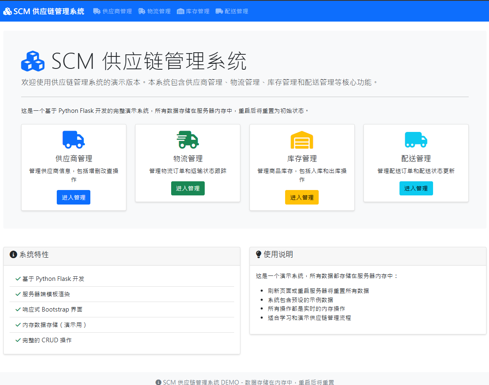

# SCM 供应链管理系统 DEMO

这是一个基于 Python Flask 开发的简易供应链管理（SCM）系统演示版本，包含供应商管理、物流管理、库存管理和配送管理等核心功能。



## 功能特性

### 供应商管理
- 查看供应商列表
- 添加新供应商（名称、联系人、电话、地址、供应商品）
- 编辑供应商信息
- 删除供应商

### 物流管理
- 查看物流订单列表
- 创建物流订单（关联供应商和目的地）
- 实时更新物流状态（待出货 → 运输中 → 已送达）

### 库存管理
- 查看商品库存信息
- 商品入库操作
- 商品出库操作
- 库存不足预警（低于阈值时高亮显示）

### 配送管理
- 查看配送订单列表
- 创建配送订单（客户信息、配送地址）
- 实时更新配送状态（准备中 → 配送中 → 已完成）

## 技术栈

- **后端**: Python Flask
- **前端**: HTML + Bootstrap 5 + Font Awesome
- **数据存储**: 服务器内存（演示用，重启后数据重置）
- **模板引擎**: Jinja2

## 安装和运行

### 1. 环境准备
```bash
./.venv\Scripts\Activate.ps1

# 确保已安装 Python 3.7+
python --version

# 克隆项目
git clone <repository-url>
cd VibeCodingSCM
```

### 2. 安装依赖
```bash
pip install -r requirements.txt
```

### 3. 运行应用
```bash
python app.py
```

### 4. 运行测试
```bash
# 运行测试脚本（需要 Linux/Mac）
chmod +x test_app.sh
./test_app.sh

# 或者直接运行应用进行手动测试
python app.py
```

### 5. 访问应用
打开浏览器访问：`http://localhost:5000`

## 项目结构

```
VibeCodingSCM/
├── app.py                 # 主应用文件
├── requirements.txt       # 项目依赖
├── PRD.md                # 产品需求文档
├── README.md             # 项目说明
├── templates/            # HTML 模板
│   ├── base.html        # 基础模板
│   ├── index.html       # 主页
│   ├── suppliers.html   # 供应商管理
│   ├── add_supplier.html # 添加供应商
│   ├── edit_supplier.html # 编辑供应商
│   ├── logistics.html   # 物流管理
│   ├── add_logistics.html # 添加物流订单
│   ├── inventory.html   # 库存管理
│   ├── delivery.html    # 配送管理
│   └── add_delivery.html # 添加配送订单
└── static/              # 静态文件（可添加CSS/JS）
```

## 初始数据

系统启动时会自动加载以下示例数据：

### 供应商数据
- ABC 电子供应商（张三，138-0000-0001）
- XYZ 物流公司（李四，138-0000-0002）

### 物流数据
- L001 订单（待出货状态）

### 库存数据
- 电子元件A（1000个，阈值100）
- 包装材料B（500个，阈值50）

### 配送数据
- D001 订单（准备中状态）

## 使用说明

1. **数据存储**: 所有数据存储在服务器内存中，演示性质，重启服务器后数据将重置为初始状态
2. **操作流程**: 支持完整的 CRUD 操作，所有更改实时生效
3. **状态管理**: 物流和配送订单支持状态更新，通过下拉菜单选择
4. **库存预警**: 当库存低于阈值时，相关行会高亮显示
5. **响应式设计**: 使用 Bootstrap 5，支持桌面和移动端访问

## 开发说明

- 基于 Flask 的服务器端渲染，不使用前端框架
- 所有路由和逻辑都在 `app.py` 中实现
- 模板继承 `base.html` 确保界面一致性
- 使用 Bootstrap 组件和 Font Awesome 图标
- 消息闪现机制提供操作反馈

## 注意事项

- 这是一个演示系统，不适合生产环境使用
- 数据不持久化，重启服务器后会丢失所有更改
- 没有用户认证和权限管理
- 仅供学习和演示供应链管理流程使用

## 许可证

MIT License
